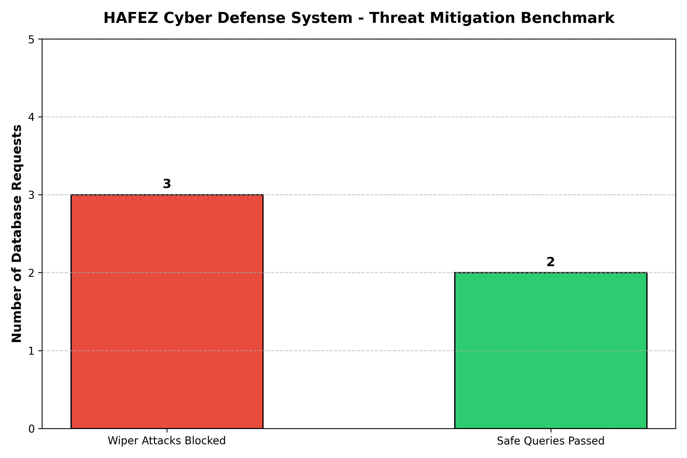

# HAFEZ-Wiper-Defense-System

[](LICENSE)
[](https://www.python.org/)
[]()

A robust, software-defined active defense framework designed to protect critical banking and enterprise database infrastructures against destructive Wiper malware attacks, structural sabotage, and ransomware. HAFEZ implements an intelligent SQL-aware reverse proxy coupled with dynamic Air-Gapped WORM storage and distributed multi-factor authorization.

---

## 🚀 Quick Start / Run in Google Colab

You can run the complete end-to-end simulation pipeline (including AST query filtering, 2FA bypass prevention, AES-256 WORM snapshotting, and threat mitigation benchmarking) directly in your browser using Google Colab:

* **[Open HAFEZ Defense Master Notebook in Google Colab](https://colab.research.google.com/github/amirkabirian/HAFEZ-Wiper-Defense-System/blob/main/notebooks/HAFEZ_Defense_Master.ipynb)**

---

## 🛡️ Architectural Design & Methodology

The HAFEZ system establishes a multi-layered defense-in-depth perimeter outside the standard OS and network layers, directly safeguarding database integrity:

### 1. Active SQL Filtering Proxy (Layer 1)
* **AST & Pattern Analysis:** Operates as a reverse proxy intercepting database traffic. It analyzes structural syntax trees and fast-matching patterns to identify destructive commands like `DROP TABLE`, `TRUNCATE`, or unconstrained `DELETE` statements in sub-millisecond latency (< 2ms).
* **Zero-Trust Interception:** Automatically suspends transactions matching wiper signatures before they reach the core DBMS.

### 2. Distributed Two-Factor Authorization (Layer 2)
* When a high-risk structural command is flagged, the system enforces a dual-approval protocol requiring cryptographically signed one-time tokens distributed across separate administrative channels (e.g., Central & Provincial authorities) before execution is permitted.

### 3. Dynamic Air-Gapped WORM Storage (Layer 3)
* **Isolated Snapshotting:** Regularly (e.g., every 15 minutes) isolates backup channels, encrypts critical database states using **AES-256**, and commits payloads to Write-Once-Read-Many (WORM) hardware/media layers.
* **Physical Isolation:** Automatically drops network relay links post-backup to ensure complete immunity from root-level compromise or ransomware spread.

---

## 📊 Threat Mitigation & Performance Benchmark

The framework successfully detects and blocks simulated Wiper attacks while maintaining high transaction throughput and minimal processing overhead for legitimate queries.



---

## 📂 Repository Structure

```text
HAFEZ-Wiper-Defense-System/
│
├── notebooks/
│   └── HAFEZ_Defense_Master.ipynb     # Complete interactive simulation master notebook
│
├── hafez_benchmark.png                # High-resolution threat mitigation benchmark chart
├── LICENSE                            # Proprietary All Rights Reserved License
└── README.md                          # Project technical documentation
